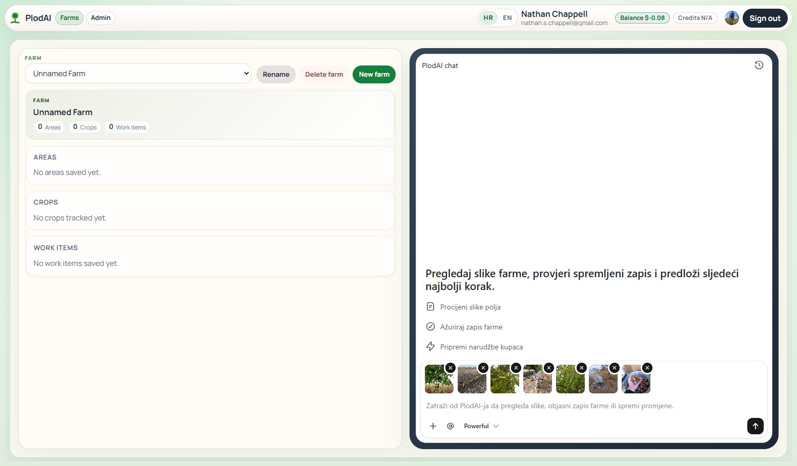
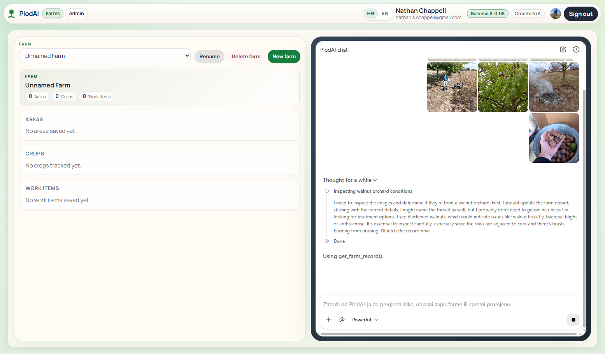
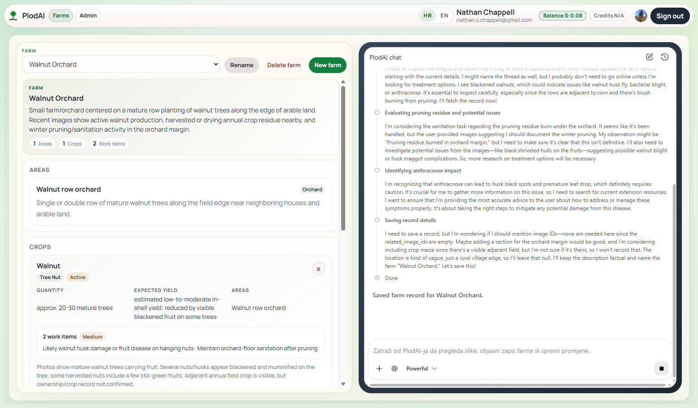
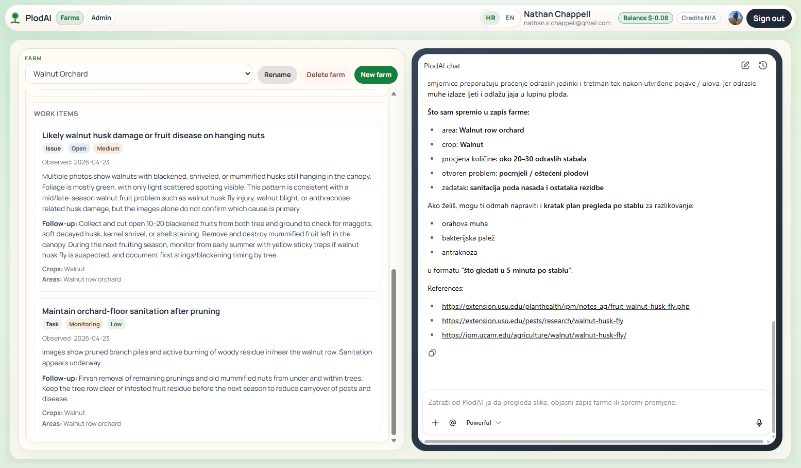

# PlodAI

PlodAI (from the Croatian `plod`, meaning "fruit" or "harvest") is an AI-assisted farm operations workspace for image review, structured farm records, and practical follow-up planning. Users can create farms, upload orchard or field images, maintain a canonical farm record, and chat with an assistant about visible conditions and next steps.

The project grew out of a real local use case. I own a small walnut grove near Tenje, and after a season affected by blight I found myself piecing together answers from photos, ChatGPT, and advice from a local agricultural pharmacy. PlodAI is an attempt to turn that fragmented troubleshooting workflow into something more durable: collect evidence, interpret it with an AI assistant, and save the result as reusable farm data instead of leaving it in a one-off chat.

This repository is both a portfolio project and a product demo. Its main technical goal is to show how a frontend-defined agent experience can be exposed through a reusable runtime built with FastAPI, ChatKit, the OpenAI Agents SDK, the Conversations API, and typed backend contracts. The current domain focus is orchard and small-farm operations in Croatia. The documentation is written in English for a public portfolio audience, while the product itself supports English and Croatian chat output.

> Live app: [plodai.up.railway.app](https://plodai.up.railway.app)
>
> Access note: signing up creates a Clerk account, but access to the live demo is granted manually. If you would like access or a walkthrough, please reach out via [GitHub](https://github.com/nathan-chappell).

The live deployment intentionally keeps infrastructure simple: Railway hosting, Railway object storage, and SQLite by default. The application is already structured around SQLAlchemy and typed service boundaries, so moving to a production database is mostly an infrastructure decision rather than a product rewrite.

## Technical overview

- Frontend stack: React 19, Vite, TypeScript, styled-components, Clerk, `@openai/chatkit`, and `@openai/chatkit-react`
- Backend stack: FastAPI, the OpenAI Agents SDK, OpenAI ChatKit server integration, async SQLAlchemy, and Pydantic
- Persistence: farm data and ChatKit memory are stored in the application database, while uploaded farm images and chat attachments are stored in S3-compatible object storage
- Runtime shape: the assistant uses tools to read and update persisted farm information through typed Pydantic models and structured outputs rather than treating the conversation as unstructured text alone
- Streaming behavior: ChatKit and the Agents SDK stream tool progress, intermediate status updates, and final assistant responses back into the UI as the run is happening
- Image workflow: uploaded images are verified, saved as farm-linked records, and sent back to the model as image inputs when visual context is needed
- Search behavior: the assistant can use OpenAI hosted web search when current public references would materially improve the answer
- Model mapping: `lightweight` -> `gpt-5.4-nano`, `balanced` -> `gpt-5.4-mini`, `powerful` -> `gpt-5.4`

## Demonstration

The screenshots below tell a simple user story: a user starts with a mostly empty farm, uploads walnut-orchard photos, lets the assistant inspect them, and ends up with a structured farm record plus a practical assessment.

### 1. The user starts with photos, not a finished dataset

In the first screenshot, the farm record on the left is still almost empty. On the right, the user has attached several walnut-orchard images in the chat composer and is about to ask PlodAI to analyze them. This matters because the workflow does not require the user to prepare a finished spreadsheet or form in advance; they can begin with natural inputs.

<p align="center">
  
</p>

### 2. The assistant inspects the images and uses tools to gather context

In the second screenshot, the assistant is already reasoning over the uploaded images. It is also using a backend tool to fetch the current farm record before deciding what to save. For a non-technical reader, this is the core agent behavior: the system is not only generating text, it is deciding what information it needs, calling a tool, and continuing with more context.

<p align="center">
  
</p>

### 3. The assistant turns observations into structured farm data

In the third screenshot, the left-hand panel is no longer blank. The assistant has created a usable farm record with a farm name, description, an orchard area, a walnut crop entry, a rough quantity estimate, an expected yield note, and initial work items. The key point is that image observations and chat context have been converted into typed application data that the rest of the product can reuse.

<p align="center">
  
</p>

### 4. The user gets a practical assessment, not just a vague summary

In the final screenshot, the user sees a clearer operational result: saved work items on the left and a practical assessment on the right, including likely issues, suggested follow-up actions, and linked public references. The intended outcome is to move from raw photos to actionable farm information that can be reviewed, updated, and reused.

<p align="center">
  
</p>

The sample images used during development are available in [`walnut_test_images/`](./walnut_test_images).

## Local setup

### Prerequisites

- Python `3.14` or newer
- Node.js and npm
- An OpenAI API key
- A Clerk application
- An S3-compatible bucket for images and chat attachments

### Environment

Create a `.env` file in the repository root. These names match the current code, including the lowercase backend settings fields.

```bash
OPENAI_API_KEY=your-openai-key
CLERK_SECRET_KEY=your-clerk-secret-key
CLERK_JWT_KEY=your-clerk-jwt-key
VITE_CLERK_PUBLISHABLE_KEY=your-clerk-publishable-key

VITE_API_BASE_URL=/api
PUBLIC_BASE_URL=http://localhost:8000
CORS_ORIGINS=["http://localhost:8000","http://127.0.0.1:8000","http://localhost:5173","http://127.0.0.1:5173"]

database_url=sqlite:///./plodai.db

# Use your own storage values in a real deployment or fork.
storage_bucket_endpoint=https://your-bucket-endpoint
storage_bucket_name=your-bucket-name
storage_bucket_access_key_id=your-access-key
storage_bucket_secret_access_key=your-secret
storage_bucket_region=auto
storage_bucket_url_style=path

# Optional ChatKit frontend defaults
VITE_CHATKIT_DEFAULT_MODEL=balanced
VITE_CHATKIT_LIGHTWEIGHT_MODEL_LABEL=Lightweight
VITE_CHATKIT_BALANCED_MODEL_LABEL=Balanced
VITE_CHATKIT_POWERFUL_MODEL_LABEL=Powerful
```

### Install and run

Run both the Python and npm toolchains from the repository root.

```bash
python -m venv .venv
source .venv/bin/activate
pip install -r requirements.txt
pip install -r requirements-dev.txt
npm install
npm run build
python main.py
```

Then open `http://localhost:8000`.

### Frontend development mode

To run the backend and Vite frontend separately:

```bash
source .venv/bin/activate
DEV_RELOAD=true python main.py
```

```bash
npm run dev
```

For that workflow, keep `VITE_API_BASE_URL` pointed at the backend API and make sure `CORS_ORIGINS` includes the Vite origin.

## Test commands

```bash
pytest
npm test
```

## Blockers

- Move the live deployment from SQLite to a production-ready database setup
- Finalize user and account management for a real public launch
- Finalize monetization, billing, and payments

## Future ideas

- Bring farm-order publishing and public order pages into the main product workflow
- Expand the public-facing order and sales flow once the launch fundamentals are in place

## Documentation note

This README was written with AI assistance in Codex using GPT-5.4, then manually reviewed and revised against the repository implementation.
