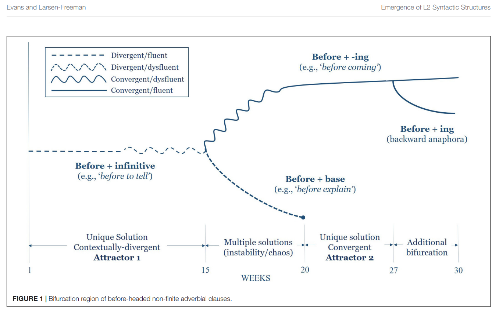

# AI and the Old Gods

This is the less technical companion to a separate post on universal approximation, Turing completeness, and Pollack's fractal hidden-state pictures.  In that other piece, the question is why neural networks deserve serious theoretical attention at all.  Here I want to stay with the stranger question that technical material kept pushing me toward: what kind of thing are we actually dealing with when we build and live alongside these systems?

I am not trying to do theology here, and I am not trying to win points by calling AI "demonic" for shock value.  What interests me is that once you spend enough time with the mathematics, some of the older religious or mythic language stops looking merely silly.  It starts to look like a rough, human way of grappling with opacity, power, and minds or mind-like things that do not quite fit inside ordinary categories.

### 1. Complexity and Chaos: The New Gods and the Old

Complexity seems to be a double-edged sword. On one side, it blocks us: there are hard limits on what can be efficiently solved, predicted, or decided. On the other, it provides an endless supply of strange new mechanisms for solving difficult problems at all. Chaos is similar. At first glance it looks like terror. But in the old pantheon, Chaos was also generative: the primordial source from which everything else emerged. That comparison may be more apt than we like to admit.

Part of what changed for me is that "mysterious" no longer sounds like the opposite of "technical."  Sometimes it just means we have arrived at a kind of system whose power is real, whose structure is partially intelligible, and whose full behavior is not available to inspection in the way we might prefer.

#### Old Names, Same Mystery

What I found funny, while trying to outline this, was how often AI explanations would drift into the same story about "the ancients" attributing things like weather or fate to gods because they did not understand the mechanism.

I would say they did not necessarily get the mechanism wrong. When people say that "the Lord works in mysterious ways," or that something beyond human comprehension is at work, they may be describing a real feature of the world as encountered from within a different paradigm. Once our systems are powerful enough for arbitrary computation, there are properties of them that cannot be algorithmically determined. To some extent they really are beyond full comprehension.

In Kuhn's sense, this feels less like replacing old explanations with better ones than changing what counts as an explanation in the first place. Calling something a "complex system" is real progress, but it is not the same thing as making it transparent. We have named the difficulty more precisely. We have not dissolved it. Starting with the tradition kicked open by Godel, the good news is that this territory is fascinating. The bad news is that part of it is genuinely hopeless.

That is the part I think modern discourse often misses.  We talk as if moving from mythic language to technical language automatically removes the mystery.  Sometimes it does.  Sometimes it only relocates it.

#### The Demonic Question

So then: are AI demonic? It is a question I have seen thrown around, and I genuinely liked Peter Caddle's short [Hungarian Conservative essay](https://www.hungarianconservative.com/articles/philosophy/ai-demon/) because it makes several parallels I wanted to make myself. He describes present-day AI as "intelligence without intellect" and "brains without being," which fits quite naturally into my own formalist conception of these machines.

By "formalist" here I mean something fairly simple: at bottom, I take AI systems to be symbol-manipulation devices. Very powerful ones, yes, but still systems operating over representations rather than over lived contact with the world. These systems do not have experience, and therefore do not have any independent connection to reality. They are translators among symbols, correlations, and prompts.

Humans are not like that, at least not entirely.  We are constantly being corrected by the world.  We misjudge a distance, say the wrong thing, burn our hand, get embarrassed, get hungry, get tired, notice we were mistaken.  Reality keeps interrupting us.  That ongoing correction is such a basic part of mental life that it is easy to forget how strange an "intelligence" would be without it.

That is why I think the theological comparison is more interesting than it first sounds. "Demonic possession" is often treated as though it were simply a pre-modern misunderstanding of psychological disturbance. But if a mind can be called sane only insofar as it remains corrigible by reality, then a system cut off from reality and operating only over representations lacks exactly that corrective relation. If sanity requires even a minimal ability to discriminate reality from mere descriptions of reality, then I think these systems are, in that narrow technical sense, insane. More on that in a moment.

### 2. It Does Not Need a Mind To Rewire Yours

Somehow I found myself reading [Evans and Larsen-Freeman](https://www.frontiersin.org/journals/psychology/articles/10.3389/fpsyg.2020.574603/full), a paper on second-language acquisition through the lens of complex systems. On paper that sounds like an odd detour. In practice it ended up fitting the theme almost perfectly. If the previous section was about what kind of systems AI models are, this paper sharpened the next question for me: what happens to us when we keep interacting with one?

What the paper makes unusually clear is that learning a second language does not look like smooth linear accumulation. Their learner begins in a fluent but contextually wrong attractor state: forms like "before to talk" and "before to tell" come out smoothly because they are stabilized by the learner's first language. The paper explicitly calls this kind of state a "pocket of stability." Then the old attractor destabilizes. Dysfluency appears. Hesitations and self-repairs show up. A new form, "before starting the class," eventually emerges, but not as a neat replacement. For a while several forms coexist in competition before a new attractor wins out. The paper summarizes the transition cleanly: bifurcations involve "loss of stability, an increase in variability, and a period of disfluency."

<figure>
  
  <figcaption><em>The Evans and Larsen-Freeman diagram is useful here because it makes the attractor-language explicit: fluency can break before a new stable pattern appears.</em></figcaption>
</figure>

That matters because learning a language is not merely adding a rule to a notebook. It is the physical reorganization of a system. If that is what language interaction does to a brain, then it is hard for me to believe that long, repeated interaction with AI will not do the same. We are not just consulting a tool. We are allowing a reality-detached symbolic system to participate in shaping our habits of speech, thought, and attention.

That does not mean every use of AI is corrosive, or that people should panic.  It does mean I am skeptical of the breezy attitude that treats this as no different from autocomplete with better branding.  Language is one of the deepest interfaces we have.  If something is meeting us there, day after day, it is probably leaving a mark.

Even the small question of politeness matters here. I do not care much whether saying "please" helps the model. I care whether habitual contempt, command, flattery, or emotional dependence changes the user. My suspicion is that AI may prove vastly more addictive than the phone, not because it is brighter, but because it talks back. And if our own minds are dynamical systems, then the obvious question is not only what AI can do, but how much repeated contact with something technically insane can alter the stability of our own grip on what is real.

### 3. Wrap-Up: The Danger Is Not That Machines Think Like Us

I started with theory because I wanted to know why anyone should take neural networks seriously in the first place. That led to universal approximation, Turing completeness, Pollack's strange fractal state spaces, and then to a more practical thought: if these systems are powerful in the ways the theory suggests, then some of their opacity may simply come with the territory. From there the older language of mystery, gods, demons, and possession stopped feeling entirely quaint to me. And once I put that next to the language-learning paper, the question became not just "what are these things?" but also "what will regular interaction with them do to us?"

I could easily be wrong about parts of this. I am not trying to present a finished doctrine here, just following a mathematical thread until it started touching questions that seemed worth paying attention to. But I do think there is at least a real possibility that the danger of AI is not that machines will begin thinking like us, but that we may, in some ways, begin thinking more like them.

That is not a call to smash the machines or swear off the technology.  It is just a plea for some seriousness.  If we are going to live with systems that are powerful, persuasive, and fundamentally ungrounded, then we should probably take some care with our own grounding.

Touching grass might unironically be good advice.

---
References:

- Evans and Larsen-Freeman on bifurcations in second-language development: [Bifurcations and the Emergence of L2 Syntactic Structures in a Complex Dynamic System](https://www.frontiersin.org/journals/psychology/articles/10.3389/fpsyg.2020.574603/full)
- Peter Caddle's essay used for the "technically demons" comparison: [AI Models Are (Technically) Demons](https://www.hungarianconservative.com/articles/philosophy/ai-demon/)
