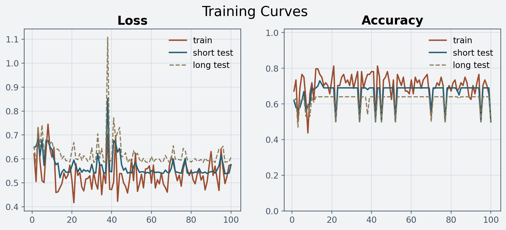
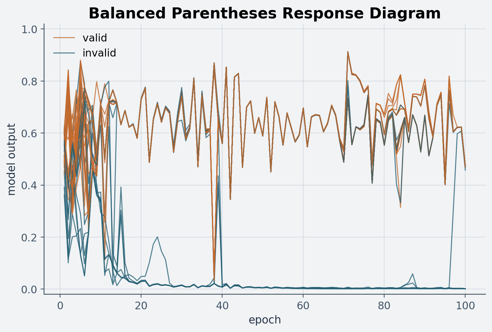
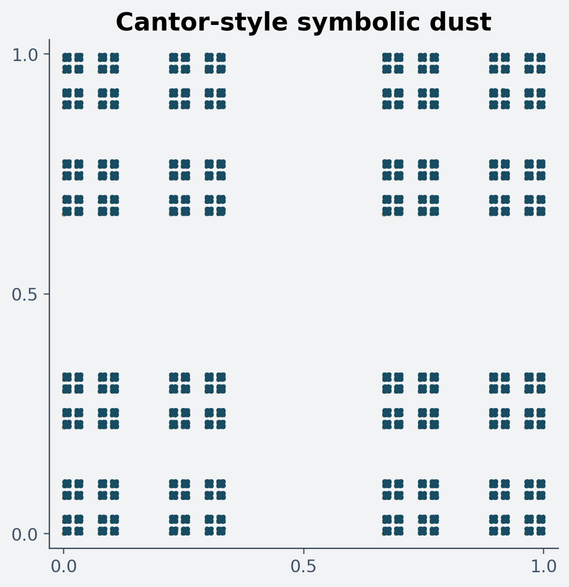
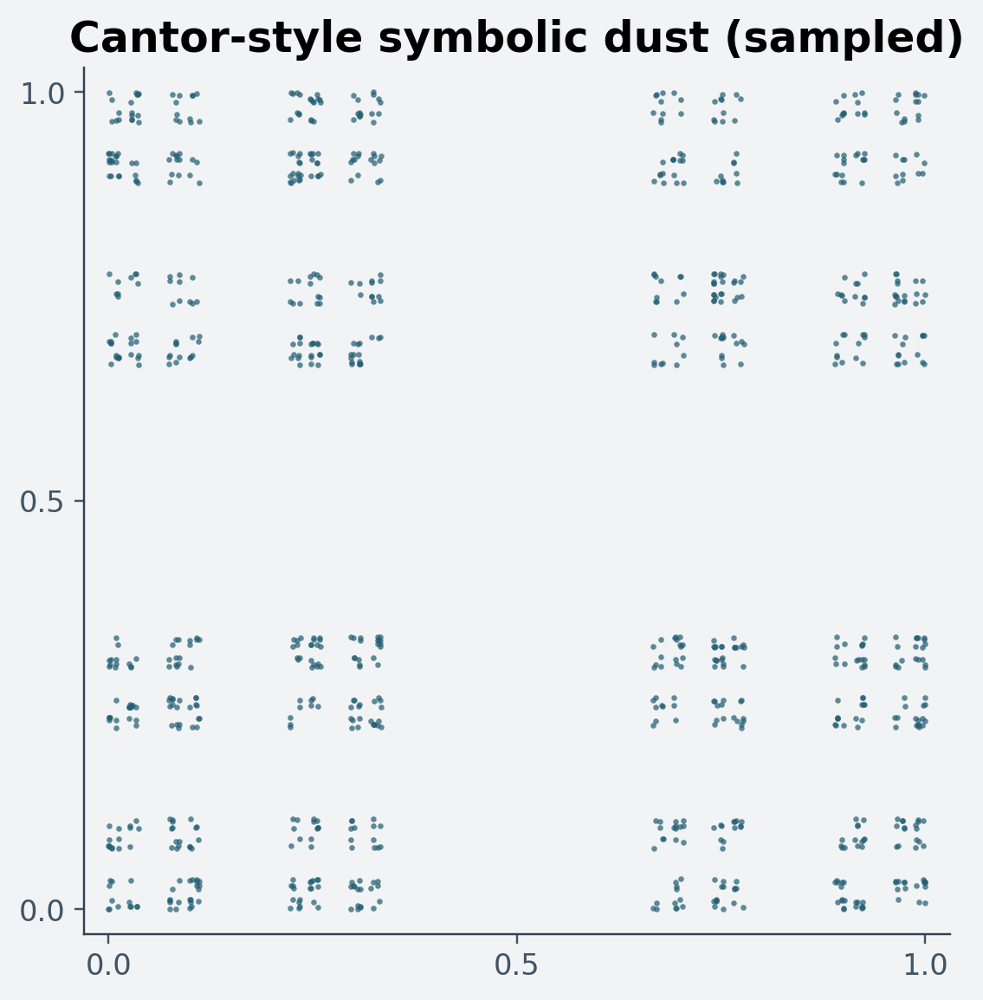

# The Theoretical Justification of Neural Networks

### 1. On Theoretical Justification

"This is computer science, so the proofs aren't unimportant."
- My Analysis Professor

When I started studying neural networks, one of my first questions was: why should I study neural networks at all?  What makes them worthy of study?  What I was searching for is what I call a "theoretical justification" for studying and attempting to create neural networks.  Well, I found two theorems that answered this question for me satisfactorily.  I'll explain the theorems, since they are interesting in their own right and provide useful context for the rest of the story, but it is really the research surrounding them that makes the whole thing start to feel alive.

This post is meant to stay on the technical side of that story.  I am not going to define Turing machines rigorously or turn this into a textbook chapter.  I just want to show why some very classical theoretical results make neural networks worth taking seriously, and why Pollack's old experiments still feel so striking.

### 2. Universal Approximation

In order to ask this question and even know what an answer might look like, we need a few definitions.  We'll consider the set of continuous functions on the interval `[0,1]`, and refer to it simply as `C([0,1])`.  This is already a very versatile set of functions, but there are still far too many of them.  We could never physically realize a machine that computes an arbitrary continuous function directly; there are simply too many.  So what is useful is a smaller, more tangible class of functions that can stand in for `C([0,1])`.  One familiar example is the set of polynomial functions.  Some beautiful results from undergraduate analysis lead to the conclusion that linear combinations of polynomials can approximate any function from `C([0,1])` arbitrarily well.

To make that phrase precise, we need a notion of distance between functions.  Given two continuous functions `f` and `g`, we measure how far apart they are by looking for the single largest gap between them anywhere on the interval.  In symbols this is the supremum distance: `d(f,g) = sup {|f(x) - g(x)| : x in [0,1]}`.

Next, we say a set of functions `F` approximates `C([0,1])` arbitrarily well if, for any error tolerance `e > 0` and any target function `g` in `C([0,1])`, we can find a function `f` in `F` such that `d(f,g) < e`.  In plain English: no matter how demanding we are, we can still choose a function from `F` that never strays more than `e` away from `g`.

So it becomes a very desirable property of an easily computable class of functions that it can universally approximate the continuous functions on its domain.

This is the first shape of the answer I was looking for.  If a class of models can, in a mathematically precise sense, get arbitrarily close to any continuous target in a broad family, then it is not just a gimmick.  It means we are looking at a flexible representational scheme with real expressive power.

Back to neural networks, first we observe that most neural networks are parameterized, and are hence part of a naturally defined class of neural networks: the class obtained by letting the parameters vary.  It is natural to then ask whether some such class of functions uniformly approximates `C([0,1])`.  It turns out that the most interesting part of the very simple architectures needed to answer this question are the activation functions, and there were a number of theorems proving that very general and simple classes of neural networks were in fact universal.  The first, sort of classic paper that gets referred to is [Cybenko's theorem](https://web.njit.edu/~usman/courses/cs675_fall18/10.1.1.441.7873.pdf), though there are simpler and more illustrative proofs for narrower classes of activations.

The picture to keep in mind is not mystical at all.  It is just a family of simple parameterized curves getting better and better at hugging some more interesting target curve.  You vary the parameters, the shape changes, and with enough flexibility the model can press itself surprisingly close to what you wanted.  That basic approximation story is the first reason I came to think neural networks deserve to be taken seriously.

`TODO:` implement in our RNN module:
A simple picture of piecewise linear curves closing in on some wavy function, something with a bit more personality than a straight line, is really the right intuition here.  This is the basic idea behind why even very simple activation schemes can end up providing universal approximation.

### 3. Turing Completeness and Where the Infinity Hides

Similar considerations can be made for recurrent neural networks (RNNs), but now we are after something stronger.  Rather than approximating some target class of functions, we want Turing completeness.  Glibly, that means the system can in principle carry out any computation a normal programming language can.  In other words, we want to know whether RNNs are really general-purpose problem-solving machines.

This is a very different kind of claim from universal approximation.  Universal approximation says the model class is expressive over a large family of functions.  Turing completeness says something like: this is not merely a clever interpolator.  In principle, it can implement open-ended symbolic procedures.

One thing that started bothering me, in a good way, is that Turing-complete systems always seem to hide an infinity somewhere.  A Turing machine has an infinite tape.  A register machine gets to use arbitrarily large integers.  The lambda calculus allows arbitrarily long reductions.  So where does the infinity go in an RNN?

In the end, it turns out that they are Turing complete - see [Siegelmann and Sontag](https://binds.cs.umass.edu/papers/1992_Siegelmann_COLT.pdf) for a good technical proof.  And the answer to the "where did the infinity go?" question is: into precision.  The symbolic structure is packed into a bounded region of state space, but doing that requires arbitrarily fine distinctions between nearby points.  The infinity has not vanished.  It has been hidden in the precision needed to represent and manipulate the state.[^precision]

That observation helped a lot of later material click into place for me.  If the power of the system is partly hiding in fine geometric structure, then looking at state space is not a cute visualization trick.  It is a way of peeking at where the computation actually lives.

### 4. Pollack, Bifurcations, and Fractal Hidden States

But before that proof was nailed down, there was already fascinating work pointing in the same direction.  Pollack's [The Induction of Dynamical Recognizers](https://www.researchgate.net/publication/226171158_The_Induction_of_Dynamical_Recognizers) is the paper that really makes the story feel alive.  He traced out the trajectories of hidden states in recurrent nets as they learned formal languages, and found abrupt qualitative changes in behavior: networks that had only managed short strings would suddenly begin handling much longer ones, including strings beyond the training range.  He treated these as "aha moments," which is exactly the right phrase.

This is also the point where the technical discussion becomes genuinely fun.  We are no longer just proving an abstract capability theorem.  We are watching a learning system pass through qualitative changes, and the geometry of those changes starts to matter.

That connection between recurrent nets and discrete dynamical systems exhibiting chaotic behavior is magnificent. You can say that AI gets some of its power from chaos, and that is not just poetry.  Pollack was not just reporting better accuracy; he was noticing that the state-space trajectories themselves were beginning to take on fractal structure.

That is also where the "chaos" starts to become more than a metaphor: it is the system's ability to move through that intricate structure in a meaningful way.  The appeal of Pollack's paper is that he does not merely borrow language from dynamics.  He treats the network as a dynamical system and then finds evidence that the dynamics really are doing computational work.

What is so striking is that Pollack really does say the strong version. In the abstract, he writes that "a small weight adjustment causes a 'bifurcation' in the limit behavior of the network" and that this phase transition corresponds to the onset of generalization to "arbitrary-length strings." He also says the architecture appears capable of generating nonregular languages by exploiting "fractal and chaotic dynamics." Later he makes the wonderfully blunt remark that "a discrete dynamical system is just an iterative computation." And the paper does not leave the idea at the level of metaphor: when discussing parenthesis balancing, he says it is mathematically possible to embed an "infinite state machine" in a dynamical recognizer, with a state space built from fractal self-similarity. That is exactly the kind of claim that made this line of thought hard for me to forget.

  <figure style="flex: 1 1 320px; margin: 0;">
    
    <figcaption><em>The thing I wanted to capture from Pollack is already visible here: performance on much longer strings can lag and then change qualitatively once the state dynamics settle into a different regime.</em></figcaption>
  </figure>
  <figure style="flex: 1 1 320px; margin: 0;">
    
    <figcaption><em>This is the closest homage to Pollack's original figure: a fixed set of characteristic strings tracked across training, with a visible split as the recognizer begins to separate regimes.</em></figcaption>
  </figure>

  <figure style="flex: 1 1 320px; margin: 0;">
    
    <figcaption><em>The layered dust version gives the cleaner large-scale geometry.</em></figcaption>
  </figure>
  <figure style="flex: 1 1 320px; margin: 0;">
    
    <figcaption><em>The sampled version is rougher and more atmospheric.  I may keep both because they suggest slightly different intuitions.</em></figcaption>
  </figure>

  <figure style="flex: 1 1 320px; margin: 0;">
    
    <figcaption><em>At the beginning these shorter probe strings do not yet seem to live in a cleanly organized region of state space.</em></figcaption>
  </figure>
  <figure style="flex: 1 1 320px; margin: 0;">
    
    <figcaption><em>By the first major checkpoint there is a little more coherence, but the geometry is still visibly unsettled.</em></figcaption>
  </figure>

  <figure style="flex: 1 1 320px; margin: 0;">
    
    <figcaption><em>Later on, the hidden-state trajectories start to look like the network is discovering a more stable computational regime.</em></figcaption>
  </figure>
  <figure style="flex: 1 1 320px; margin: 0;">
    
    <figcaption><em>At the end, the same probe input traces a much more structured picture, which is the closest thing here to Pollack's visual argument.</em></figcaption>
  </figure>

### 5. Wrap-Up

So for me, that is the theoretical justification.  Feedforward networks are already broad enough to approximate an enormous class of functions.  Recurrent networks go further and cross into general computation.  And once you notice that the price of that power is hidden structure, precision, and opacity, the conversation naturally starts drifting away from engineering and toward dynamics, complexity, and interpretation.

That is enough, I think, to justify real attention from anyone who likes theory.  Even if one turned out to dislike most present-day AI products, these are still beautiful and slightly unsettling mathematical objects.  The more philosophical story begins when we ask what it means to live with them.  But that is really a second post.

---
References:

- Classic paper on universal approximation: [Cybenko - Approximation by Superpositions of a Sigmoidal Function](https://web.njit.edu/~usman/courses/cs675_fall18/10.1.1.441.7873.pdf)
- Turing-completeness result for recurrent nets: [Siegelmann Sontag 1992 - On The Computational Power Of Neural Nets](https://binds.cs.umass.edu/papers/1992_Siegelmann_COLT.pdf)
- Pollack on dynamical recognizers, phase transitions, and fractal state spaces: [Pollack 1991 - The Induction of Dynamical Recognizers](https://www.researchgate.net/publication/226171158_The_Induction_of_Dynamical_Recognizers)

[^precision]: One convenient model is to map a binary stack `a = (a_1, a_2, ...)`, with `a_i in {0,1}`, to the real number `x(a) = sum_{i=1}^{infty} a_i 2^{-i}`. Using two stacks gives a point `(x(a), x(b)) in [0,1]^2`. In this way one obtains two Cantor-like coordinate sets, and hence a fractal subset of the square on which symbolic structure can be encoded geometrically.
