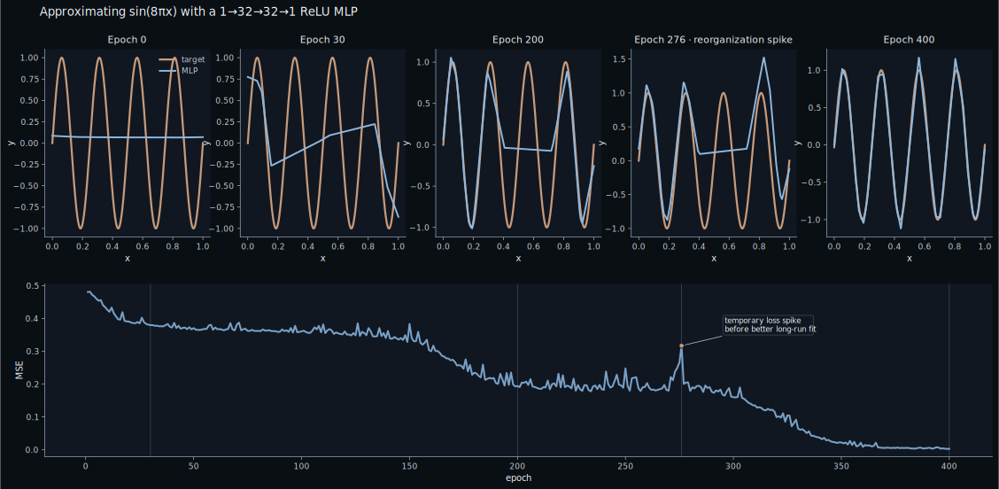
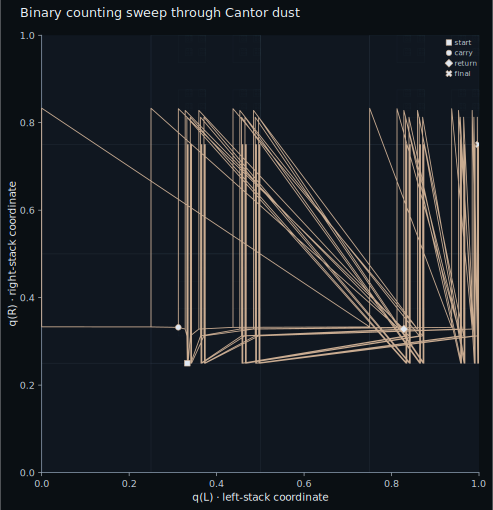
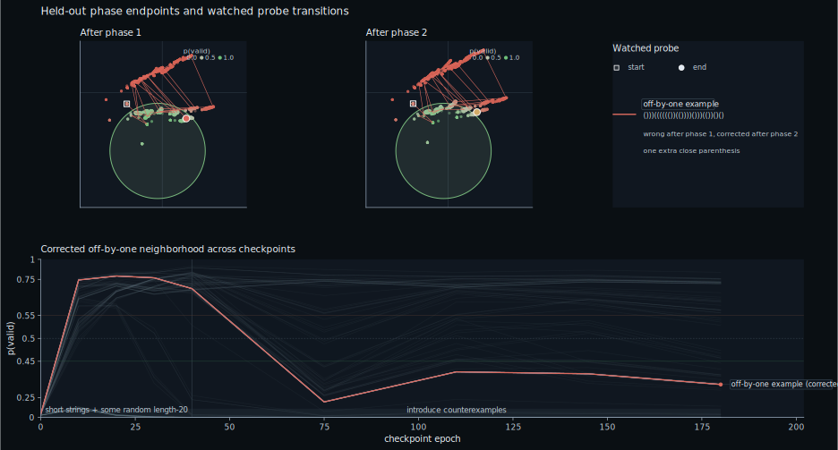

# A Theoretical Justification of Neural Networks

### 1. On Theoretical Justification

"Theoretical justification" is a term I use for a mathematically consistent reason to think something is a good idea.  In the case of neural networks, I mean something narrower: why is it justified to expend so much effort on them, and what kinds of computation make that effort intelligible?  Rather than try to answer that in full generality, I want to approach it in a much more restricted form.  What can neural networks represent, and what can they compute?

Two classical results provided me with an answer I found satisfying.  Universal approximation shows that feedforward networks, once treated as parameterized families of functions, are rich enough to approximate broad classes of targets (with very little regard to their architectural complexity).  Recurrent networks compute in a fundamentally different way, and so for them the question of expressivity quickly becomes a question about what they can compute.  The classical answer is that they are Turing complete.

In trying to understand that result, I ended up reading Pollack's paper on dynamical recognizers.  There recurrent networks are treated as discrete dynamical systems, with hidden states traced through recurrent steps as the computation unfolds.  What emerges is a much stranger picture: trained recurrent neural networks (RNNs) begin to exhibit bifurcations, signs of chaos, and fractal state spaces.  The suggestion is not just that they can compute, but that they may be using geometry itself, even fractal geometry, as a kind of data structure.

### 2. Neural Networks as Mathematical Functions

A neural network with a fixed architecture and fixed parameters is just a mathematical function. Give it an input, pass that input through a sequence of affine maps and nonlinearities, and what comes out is a point in some output space.

An architecture becomes a family of functions once we let its parameters vary. The weights and biases are parameters, and each choice of those parameters picks out a different function. Learning for a neural network is, in that sense, choosing a better function from this family. The natural question is how well this architecture can approximate some family of functions, for example any given continuous function. That is where the notion of universal approximation becomes useful.

### 3. Universal Approximation

*Figure caption: selected checkpoints from a small rectified linear unit (ReLU) multilayer perceptron (MLP) fitting a rapidly oscillating sine wave on the unit interval, making the family-of-functions picture visible: around epoch 276, the network accepts worse short-term loss while shifting breakpoints and flattening a segment, then settles into a much better global fit. The improvement comes by reorganizing the represented function, not by uniformly polishing the old one.*

Consider the figure.  A small ReLU MLP is trying to fit a rapidly oscillating sine wave on the unit interval.  In one dimension, that means it is representing the target by a piecewise-linear curve.  As the network traverses parameter space, it can tilt line segments, move their endpoints left or right, and change where one segment gives way to the next.  Those changes do not happen independently.  Segments fight each other.  Making one region better can make another region worse.

That is what makes the temporary deterioration in the figure interesting.  The network gives up a noticeable amount of fit while shifting its endpoints around.  One segment seems to have to negotiate with its neighbors and become nearly horizontal before a much better global arrangement becomes available.  After that, the fit improves sharply and the network looks much closer to a configuration that has already discovered the right overall shape.  The point of the picture is that learning here is not just local polishing.  It is movement through a family of possible functions, and sometimes that movement requires reorganization.

Universal approximation is an existence result. It does not require that any particular learning algorithm exist for finding the right parameters, only that for any continuous target on the unit interval and any tolerance, there is some parameterization of the network whose graph stays that close to the target everywhere on the interval. Cybenko's theorem is the classical version of a broader line of results covering activations including tanh and ReLU.

So this class of results, and Cybenko's theorem in particular, provide a theoretical justification for feedforward neural networks.  In principle, one model class is broad enough to solve any continuous approximation problem well enough, provided the parameters are chosen appropriately.

### 4. Turing Completeness and Hidden Geometry

A feedforward network is naturally treated as a static function: it takes an input and returns an output. A recurrent neural network (RNN) computes differently. It reads a sequence one symbol at a time, updates a hidden state, and can keep producing outputs as the sequence unfolds. That hidden state is the running memory of the computation. The question is no longer only how rich a function class is. We are asking what computations this evolving state can implement. On a given string, the hidden state traces out a path, and that path is the computation. The image below makes the idea concrete. A Turing machine counts from zero to sixty-three in a six-bit register. Digits to the left of the head determine one coordinate, read outward from the head, while the head and the digits to the right determine the other. As the count advances, carries push the head left across trailing ones, then the machine sweeps back right. A familiar counting routine becomes a jagged path through a bounded region.

*Figure caption: a two-stack Cantor encoding of an unbounded tape, making the computational picture concrete: symbolic state is encoded geometrically, and computation appears as a traversal of that geometry.*

The main panel shows those address changes accumulating into a full symbolic computation. Writes, carries, and returns through the Cantor dust appear as chaotic movement across a semantically meaningful fractal. The geometry is not decorative. It is carrying the computation.

Once geometry can play the role of tape, the natural question is immediate: are recurrent neural networks Turing complete? Do they have the power of a general-purpose computer? According to the early results of Siegelmann and Sontag, the answer is yes. They give constructions that take a Turing machine and produce parameters for a recurrent network whose state evolution simulates the machine's computation.

That settles the formal question. Universal approximation provides the theoretical justification for feedforward networks; Turing completeness provides it for recurrent neural networks. In the sense relevant here, recurrent neural networks can perform arbitrary computation. That is the theoretical justification we were looking for.

### 5. Bifurcation and Language Learning

Once the theoretical limits are found, what remains is learning. A dynamical-systems view is useful here because it asks how a system moves between relatively stable patterns over time. A useful example comes from second-language development: a learner can remain in one stable but contextually wrong habit, pass through a noisier and more variable phase, and only then settle into a different stable pattern.

*Figure caption: Evans and Larsen-Freeman present second-language development as a bifurcation: one stable pattern holds for a while, then breaks into a more variable phase, and eventually gives way to a different stable pattern. The important point here is the shape of the transition.*

That is the kind of transition I wanted to bring back to recurrent networks. If learning is not just accumulation but reorganization, then hidden-state geometry becomes something we can watch change over time.

Balanced parentheses is a good test case because the distinction between success and failure is structural. A network can get quite far with cheap local heuristics, but eventually it has to encode the right computation in its geometry. So the figure follows carefully chosen off-by-one failures: cases selected because they defeat the easiest heuristics and therefore make good probes of whether the network has actually learned the computation. In the figure below, the watched counterexample is gradually learned, but the more interesting event is local. Nearby bands shift, neighboring cases wobble, and the learned boundary reorganizes as the network becomes better at separating structurally different strings.

*Figure caption: the upper panel shows held-out hidden states over training, and the lower panel follows one carefully chosen off-by-one counterexample against nearby same-length edits. The neighborhood is reorganized, not merely corrected: nearby cases shift, wobble, and then separate more sharply as the learned geometry encodes the computation more effectively.*

### 6. Wrap-Up

Universal approximation explains why feedforward neural networks matter as families of functions: in principle, one model class is broad enough to approximate any continuous target well enough. Turing completeness explains why recurrent neural networks matter as computational media: in principle, they can perform arbitrary computation. Those are the theoretical justifications I was looking for.

What kept the story interesting for me after that was the dynamical point of view. If recurrent computation is written into geometry, then learning may have to appear as a reorganization of that geometry. Recurrent neural networks can perform arbitrary computation, and observations of real learning can still help us think about how such systems acquire a better computation.

---
References:

- Universal approximation for sigmoidal networks: [Cybenko 1989 - Approximation by Superpositions of a Sigmoidal Function](https://doi.org/10.1007/BF02551274)
- Early recurrent-net computational power result: [Siegelmann and Sontag 1992 - On the Computational Power of Neural Nets](https://doi.org/10.1145/130385.130432)
- Journal version of the recurrent-net computational power result: [Siegelmann and Sontag 1995 - On the Computational Power of Neural Nets](https://doi.org/10.1006/jcss.1995.1013)
- Dynamical recognizers, bifurcations, and fractal state spaces: [Pollack 1991 - The Induction of Dynamical Recognizers](https://doi.org/10.1007/BF00114845)
- Bifurcations in second-language development: [Evans and Larsen-Freeman 2020 - Bifurcations and the Emergence of L2 Syntactic Structures in a Complex Dynamic System](https://doi.org/10.3389/fpsyg.2020.574603)
