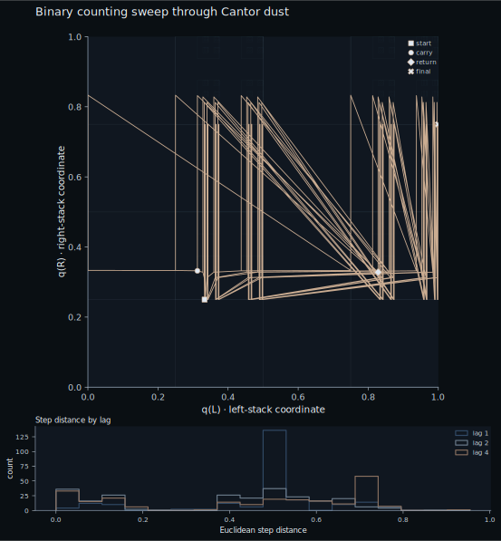
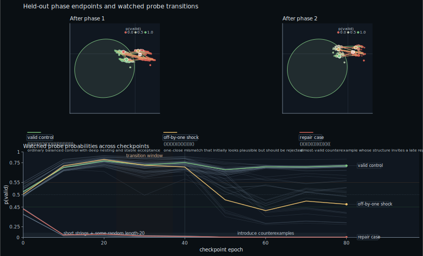

# The Theoretical Justification of Neural Networks

### 1. On Theoretical Justification

"This is computer science, so the proofs aren't unimportant."
- My Analysis Professor

When I started studying neural networks, one of my first questions was why they were considered important enough to deserve such serious attention. What I was looking for is what I still think of as a theoretical justification: not a list of successful applications, but a mathematical reason to think neural networks are the kind of object worth studying in the first place. For me, two classical theorems provided that justification.

What stayed with me for a different reason was Pollack's work on dynamical recognizers. The theorems satisfied me. Pollack's paper struck me as genuinely cool. And when similar dynamical language showed up again in work on language learning, it started to feel like a neat link among dynamical systems, recurrent nets, and the possibility that language learning itself has this same kind of nonlinear reorganization story.

First, once feedforward networks are viewed as families of mathematical functions, universal approximation explains why that abstraction matters. Second, recurrent networks go further: they are not merely expressive function approximators, but general computational media in the Turing-complete sense. Pollack then becomes interesting because he treats learning as a reorganization of hidden-state geometry, and that same style of nonlinear description reappears, in a very different setting, in work on language learning.

### 2. Neural Networks as Mathematical Functions

Before universal approximation enters the story, it helps to say plainly what sort of object a neural network is. A network with fixed architecture and fixed parameters is just a mathematical function. Give it an input, pass that input through a sequence of affine maps and nonlinearities, and what comes out is a point in some output space. Once the architecture is fixed and the parameters are allowed to vary, one no longer has a single function but a whole family of functions. At that level of abstraction, learning is a search through a parameterized function class.

For a scalar-output network with one hidden layer, the family has the form
$$
x \mapsto \sum_{j=1}^m c_j \,\sigma(a_j x + b_j),
$$
where the width $m$ and the parameters $a_j,b_j,c_j$ may vary. In higher dimensions, $a_j x + b_j$ becomes an affine form $w_j \cdot x + b_j$, but the idea is the same: compose simple affine maps with a nonlinearity, then linearly combine the resulting features. ReLU networks give piecewise-linear functions, sigmoidal networks give smooth ones, but in either case the architecture defines a genuine function class. That is the real object of study.

From there the next question more or less asks itself. How large is this class inside a natural space of target functions? Is it narrow, or is it rich enough to approximate essentially any continuous behavior one might reasonably want on a compact domain? That is what the universal approximation theorem answers.

### 3. Universal Approximation

A convenient stage for the classical discussion is the space $C([0,1])$ of continuous functions on $[0,1]$; if one likes, simply all continuous curves on that interval. We measure distance with the uniform metric
$$
d_\infty(f,g)=\sup_{x \in [0,1]} |f(x)-g(x)|.
$$
We say a class $F$ approximates $C([0,1])$ arbitrarily well if for every target $g \in C([0,1])$ and every tolerance $\varepsilon > 0$, there exists some $f \in F$ with $d_\infty(f,g) < \varepsilon$. In plainer language: no matter which continuous target curve one names, and no matter how strict the error tolerance, some function in the class can stay uniformly close to it. This is the same kind of density statement that appears elsewhere in classical analysis. Polynomials, for example, are dense in $C([0,1])$ by Weierstrass. The question is whether a neural-network family can play the same role.

Cybenko's theorem says that, in the classical single-hidden-layer sigmoidal setting, the answer is yes. On compact domains, finite linear combinations of such activated affine functions are dense in the relevant space of continuous targets. There are many later variants and refinements, but the basic theoretical point is already in place: once the parameters are allowed to vary, even a very simple neural architecture defines a universal approximation scheme.

One starts with a family of simple parameterized functions and varies the parameters until the family hugs a target more and more closely. The surprising part is not the intuition but its scope. The theorem says that, on compact domains, this simple mechanism is already universal.

![A small ReLU MLP learning sin(8πx) on [0,1], with selected checkpoints above and loss below.](../../frontend/public/blog-assets/theoretical-justification-of-neural-networks/mlp-sine-story.svg)

*Figure caption: selected checkpoints from a small ReLU MLP fitting `sin(8πx)` on `[0,1]`. It matters because the fit improves only after a short-term deterioration, suggesting a reorganization of the represented function rather than smooth local refinement.*

What is worth watching in that figure is the brief loss increase around epoch `276`. The network first gets worse and only then finds a much better eventual fit. Read loosely, it is adjusting the effective topology of the function it represents: not just nudging amplitudes pointwise, but reallocating its piecewise-linear regions so a previously neglected oscillation can be captured. That is a small feedforward version of a theme that returns later. Learning is not always monotone refinement. Sometimes it proceeds by reorganizing geometry.

### 4. Turing Completeness and Hidden Geometry

RNNs enter the story because they compute in a different way. A feedforward network takes an input, produces an output, and is naturally studied as a family of functions on a fixed domain. A recurrent network processes sequences, can emit sequences, and carries state forward through time. Once the computation itself unfolds step by step, the question of theoretical justification changes flavor. We are no longer asking only how rich the function class is. We are asking what kind of symbolic process the system can implement.

At a high level, an RNN is a state-updating system. As symbols arrive one by one, the network revises its hidden state, carries information forward, and continues evolving in time. What matters is not only the current symbol but the whole state the network has built up from the symbols that came before.

At that level of abstraction, processing a string means driving a dynamical system with a sequence of symbols. The resulting trajectory through hidden-state space encodes the computation the network is carrying out on that input. When one speaks about an RNN recognizing a language, this is the picture to keep in mind: the network reads a symbolic sequence, evolves its internal state, and the evolution itself is the mechanism by which structured distinctions are made.

That leads to the natural question: are RNNs Turing complete? Put differently, can a recurrent neural network do more than approximate a broad class of functions? Can it, in principle, carry out arbitrary symbolic procedures? The answer, by the classical result of Siegelmann and Sontag, is yes. Recurrent neural networks are Turing complete. Glibly but usefully, that means that they can in principle carry out anything a conventional programming language can, given the right construction. More importantly, the abstraction crosses the line from expressive curve family to general computational substrate.

That is already enough to make recurrent nets theoretically interesting. But there is a further question that becomes hard to resist once one starts thinking about Turing completeness in continuous systems: where is the computational structure actually living? In a Turing machine it is easy to point at the tape. In a recurrent network the story is geometric. The machine's memory is encoded into the organization of state space and the dynamics that move through it.

#### An aside: where the infinity hides

One thing I find interesting about computationally complete systems is that they always seem to hide an infinity somewhere. In a Turing machine it is the tape. In other formalisms it may be unbounded integers or arbitrarily long reductions. The recurrent-net story is no different. The infinity has not gone away; it has moved into precision. In the recurrent-net constructions, unbounded symbolic structure is compressed into bounded regions of continuous state, and the price is precision. One standard picture is to encode a binary stack by a real number
$$
q(a)=\sum_{i=1}^{\infty}(2a_i+1)4^{-i},
$$
so that two stacks determine a point in a Cantor-dust subset of $[0,1]^2$. The exact formula is less important than the point it makes: bounded state space can still carry unbounded symbolic structure if it is organized recursively enough.

*Figure caption: a two-stack Cantor encoding of an unbounded tape. It matters because it shows how symbolic updates can be realized as motion through a recursively structured region of bounded state space.*

That point of view also makes the hidden-state geometry of actual trained networks more interesting. If recurrent nets are important partly because they can act as computational media, then state-space organization is not a side issue. It is close to the mechanism.

Balanced parentheses is a useful toy problem here because the distinction between success and failure is structural. A network can get quite far with cheap local heuristics, but eventually it has to separate genuinely valid strings from strings that are only almost valid. That makes it a good place to look for a reorganization in hidden-state geometry rather than a mere increase in confidence.

The figure below is meant to show that kind of change. It follows a small recurrent network through training, with the upper panel showing held-out hidden states and the lower panel tracking one watched counterexample across checkpoints. Early on, that probe is misclassified: its trajectory still falls inside the acceptance ball. Later, the model learns a geometry that pushes it back out. Because the trace is a projection of hidden states through time, the zig-zag motion is part of the point. As the string unfolds, the network is keeping track of its structure and moving the state back and forth accordingly.

*Figure caption: the upper panel shows held-out hidden states over training, and the lower panel follows one off-by-one counterexample through the decision region. It matters because the same structured trace is first accepted and later forced out of the acceptance ball as the learned geometry changes.*

What interests me in the figure is the "aha moment": after a certain point, strings that used to sit implausibly close to the accepting region become much more clearly separated. The network appears to learn a better geometric encoding of failure states. That is the recurrent analogue of the earlier feedforward picture. The important change is not just numerical error going down. It is structure becoming easier for the network to represent.

### 5. Bifurcation and Language Learning

The reason Pollack's bifurcation language stuck with me is that it gives a good name for a kind of learning event that does not look like smooth accumulation. A system can spend a long time in one relatively stable regime, then pass through a narrower interval in which the old organization breaks down and a new one emerges. In the RNN case, that is the appeal of the "aha moment" language: the interesting event is not just that the score improved, but that the geometry seems to reorganize in a way that supports a stronger structural distinction than before.

Evans and Larsen-Freeman make the same general pattern visible in language learning. Their learner begins in a stable but contextually wrong syntactic habit, passes through a more variable and dysfluent phase, and only then settles into a new stable regime. That is what the bifurcation picture is doing. It is not claiming that learning is magical or discontinuous in some absolute sense. It is showing that development can proceed by destabilization and reorganization rather than by smooth linear accumulation.

*Figure caption: a bifurcation diagram from second-language development. It matters because it makes the nonlinear pattern explicit: one stable regime breaks down, variability rises, and a new regime emerges.*

That is the link back to recurrent nets. Pollack's experiments, the balanced-parentheses figure above, and the language-learning diagram are all interesting for the same reason: they treat learning as a change in organization, not just a gradual improvement in output. I do not mean that a human language learner is literally an RNN. The point is that the same dynamical description can illuminate both cases: a stable regime, a period of instability, and then a new way of encoding structure.

### 6. Wrap-Up

So that, for me, is the theoretical justification. Universal approximation explains why feedforward networks matter as a mathematical abstraction. Turing completeness explains why recurrent networks matter as a computational one. Pollack's contribution is interesting because he looks at how such systems learn by reorganizing hidden-state geometry, and that dynamical way of talking is not confined to neural nets: similar nonlinear transitions appear in language learning as well.

Those are the two classical results I was looking for. The rest of the story begins when one asks what it means for the relevant structure to live in geometry, dynamics, and opacity rather than in a neat symbolic tape we can inspect directly. That is where the subject starts to feel alive.

---
References:

- Universal approximation for sigmoidal networks: [Cybenko 1989 - Approximation by Superpositions of a Sigmoidal Function](https://doi.org/10.1007/BF02551274)
- Early recurrent-net computational power result: [Siegelmann and Sontag 1992 - On the Computational Power of Neural Nets](https://doi.org/10.1145/130385.130432)
- Journal version of the recurrent-net computational power result: [Siegelmann and Sontag 1995 - On the Computational Power of Neural Nets](https://doi.org/10.1006/jcss.1995.1013)
- Dynamical recognizers, bifurcations, and fractal state spaces: [Pollack 1991 - The Induction of Dynamical Recognizers](https://doi.org/10.1007/BF00114845)
- Bifurcations in second-language development: [Evans and Larsen-Freeman 2020 - Bifurcations and the Emergence of L2 Syntactic Structures in a Complex Dynamic System](https://doi.org/10.3389/fpsyg.2020.574603)
